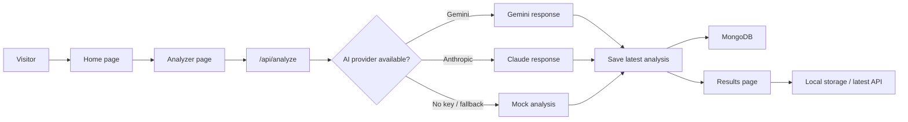
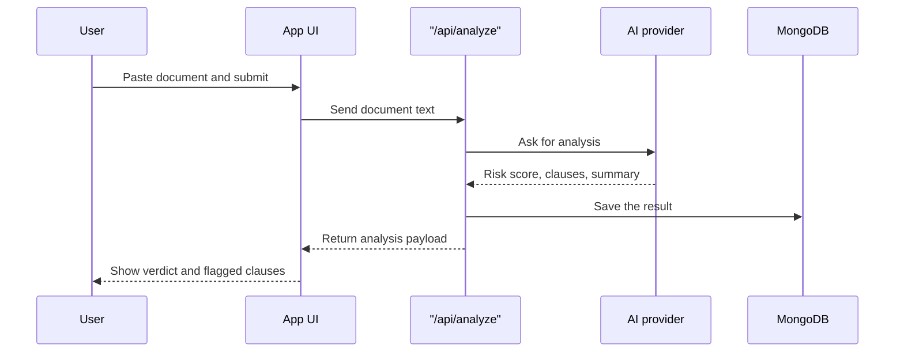

# NyayaSetu

NyayaSetu is a small legal-document helper built with Next.js. The idea is simple: paste in a contract, notice, or agreement, and get a clearer read on the risky parts before you sign anything.

It can explain the text in English, Hindi, or Hinglish, point out clauses that look one-sided, and keep the latest analysis handy for later.

## What it does

- Scans document text and pulls out clauses that deserve attention.
- Gives a short verdict, a risk score, and a few practical next steps.
- Supports English, Hindi, and Hinglish output.
- Falls back to a built-in mock analyzer if AI keys are not available.
- Stores the latest analysis in MongoDB when a database is configured.

## How the app fits together





## Project layout

```text
app/                Next.js routes, pages, and API endpoints
backend/lib/        MongoDB, auth, analysis, and RAG helpers
frontend/pages/     Page-level UI for home, app, results, and extras
frontend/components/ Shared shell components
frontend/lib/       Client-side analysis storage helpers
```

## Run it locally

1. Install Node.js 18 or newer.
2. Open the project folder in a terminal.
3. Install dependencies:

	```bash
	npm install
	```

4. Create a `.env.local` file in the project root if you want database or AI-backed analysis.

	```env
	MONGODB_URI=your-mongodb-connection-string
	MONGODB_DB=nyayasetu
	# or MONGODB_DB_NAME=nyayasetu

	GEMINI_API_KEY=your-gemini-key
	# or GOOGLE_API_KEY=your-google-key

	ANTHROPIC_API_KEY=your-anthropic-key
	SESSION_SECRET=any-long-random-string
	```

5. Start the dev server:

	```bash
	npm run dev
	```

6. Open `http://localhost:3000` in your browser.

## Helpful scripts

- `npm run dev` starts the local development server.
- `npm run build` creates a production build.
- `npm run start` runs the built app.
- `npm run lint` checks the code with ESLint.

## A couple of notes

- If no AI key is set, the app still works, but it uses the built-in fallback analysis.
- If MongoDB is not configured, the app can still show results, but it will not persist them.
- The results page also looks at browser local storage, so the latest analysis stays visible in the current browser.
